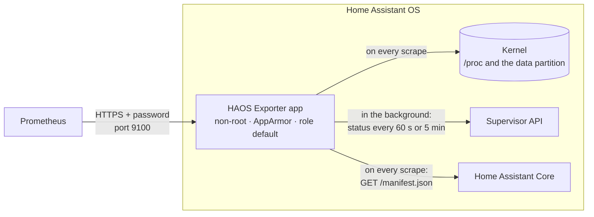

<div align="center">

# HAOS Exporter

**Prometheus metrics for Home Assistant OS itself.**<br>
Host health, data disk space, Supervisor state, pending updates, apps and
backups, from one locked-down Home Assistant app (formerly called an add-on).

[](https://my.home-assistant.io/redirect/supervisor_add_addon_repository/?repository_url=https%3A%2F%2Fgithub.com%2FTBording%2Fhaos-exporter)

[](https://github.com/TBording/haos-exporter/actions/workflows/ci.yml)
[](haos_exporter/CHANGELOG.md)


[](LICENSE)

[What you get](#what-you-get) ·
[Installation](#installation) ·
[Starter alerts](#starter-alerts) ·
[Troubleshooting](#troubleshooting) ·
[Security model](#permissions)

</div>

Home Assistant's built-in
[`prometheus:` integration](https://www.home-assistant.io/integrations/prometheus/)
exports your **entities**: lights, sensors, switches. HAOS Exporter covers the
**system underneath** them. Is the data disk filling up? Is the Supervisor
unhealthy, and why? Which updates are waiting? When was the last backup? Has
an app stopped? It runs beside Home Assistant rather than inside it, so it
keeps reporting while Core is down, and it is built to need as little access
to your home as possible.

> [!NOTE]
> **Experimental.** Tested on Home Assistant OS 18.3 (an x86-64 VM) with
> Supervisor 2026.09.2 and 2026.09.3 and Core 2026.9. The aarch64 image is
> built and signed by CI but has not yet run on ARM hardware.
> [Reports are welcome](https://github.com/TBording/haos-exporter/issues).

## What you get

| | Area | What it tells you |
|:-:|---|---|
| 🖥️ | **Host** | CPU, memory, load, disk IO and pressure stalls, in node_exporter's metric names, so the dashboards and alerts you already have keep working. |
| 💾 | **Data disk** | Free space on the data partition. Below 2 GiB the Supervisor refuses updates, backups and app installs, so you want to know first. |
| 🩺 | **Supervisor** | Whether it is healthy and supported, plus the resolution center's issues, suggestions and the reasons behind them. |
| 🔄 | **Updates** | Installed and latest versions of Core, Supervisor and OS, and which apps have an update waiting. |
| 📦 | **Apps** | The state of every installed app: started, stopped or in error. |
| 🗄️ | **Backups** | How many there are, how big they are, and when the newest one was made, per type. |
| 💓 | **Core** | Whether Home Assistant's web server answers. |
| 🔎 | **Itself** | Whether each collector is working, and a security self-check at every start. |

A taste of the output (values from the test fixtures):

```text
# Is the data disk filling up?
node_filesystem_avail_bytes{device="/dev/sda8",fstype="ext4",mountpoint="/mnt/data"} 1.47456e+10
# Is the Supervisor healthy, and if not, why?
haos_supervisor_healthy 0
haos_resolution_unhealthy{reason="privileged"} 1
haos_resolution_suggestions{context="system",type="create_full_backup"} 1
# What needs updating?
haos_component_version_info{component="os",version="16.0",version_latest="16.1"} 1
haos_updates_pending{type="app"} 2
# Are the apps running?
haos_app_state{slug="core_example_broker",state="started"} 1
# When was the last backup?
haos_backup_latest_timestamp_seconds{type="partial"} 1.7681004e+09
# Is Home Assistant answering?
haos_core_up 1
```

Every metric, with its labels and source, is listed in
[DESIGN.md § Metrics](DESIGN.md#metrics).

### Locked down by default

A metrics endpoint on your network should not become a way into your home.
HAOS Exporter asks for as little as it can:

- **The lowest Supervisor role (`default`).** It can read status, but it
  cannot restart Home Assistant, install or remove other apps, or restore or
  delete backups.
- **No access to Home Assistant itself.** It cannot read or change entities
  or call services.
- **Protection mode stays on.** No host network, host PID, Docker socket or
  hardware access.
- **A custom AppArmor profile in enforce mode.** The process cannot write
  outside `/tmp`, cannot start other programs, and has no capabilities.
- **Non-root, in a distroless image** with no shell and no package manager.
- **A password is required and HTTPS is on by default.** The app will not
  start without a password hash. Prometheus can also pin the app's
  certificate, and the app can require a client certificate.
- **Signed releases.** Every image is signed with cosign and carries build
  provenance and an SBOM, which you can [verify yourself](#releases).
- **It checks itself.** At every start it tests its own confinement and
  reports the result as a metric.

The full permission table and threat model are further down, under
[Permissions](#permissions) and [Threat model](#threat-model).

### How it works



- **Host metrics** are read from the kernel on every scrape.
- **The Supervisor** is polled in the background, every 60 s or 5 min
  depending on the endpoint. A scrape serves the latest result, so a short
  scrape interval adds no load on the Supervisor.
- **Core** is checked with an unauthenticated `GET /manifest.json`. The
  exporter never calls Core's `/api/`, where every rejected request counts as
  a failed login and raises a notification.

### Not exported, by design

- **Entity states.** The `prometheus:` integration already does that; run
  both.
- **Per-container CPU and memory** for Core, the Supervisor and apps. The
  Supervisor only serves those to the `manager` role, which can also install
  apps. A network-facing process should not hold that token.
- **Host network interface counters.** They would need host networking. If
  Home Assistant OS runs in a VM, the hypervisor already exports the VM's
  NIC counters.
- **Boot partition usage.** `/mnt/boot` is not visible inside an app.

## Installation

### What you need

- **Home Assistant OS** on an amd64 (x86-64) or aarch64 (64-bit ARM) machine.
- **Prometheus**, able to reach Home Assistant on TCP port 9100.
- **`htpasswd`** on your computer, to make a password hash. It is
  preinstalled on macOS; on Debian and Ubuntu it is in `apache2-utils`.
  [DOCS.md](haos_exporter/DOCS.md#generating-the-password-hash) shows a
  Python alternative.

### Step 1: Add the repository

Select the button, and Home Assistant opens with the repository filled in:

[](https://my.home-assistant.io/redirect/supervisor_add_addon_repository/?repository_url=https%3A%2F%2Fgithub.com%2FTBording%2Fhaos-exporter)

Or add it by hand: go to **Settings › Apps › Install app**, open the **⋮**
menu in the top-right corner, select **Repositories**, add
`https://github.com/TBording/haos-exporter`, and select **Add**.

### Step 2: Install the app

Find **HAOS Exporter** in the app store and select **Install**. The Supervisor
downloads the signed image for your machine; nothing is built on your device.

Then, on the app's **Info** tab, turn on **Watchdog**. It is off by default,
and with it the Supervisor restarts the app if its port stops answering.

### Step 3: Create a password and its hash

Prometheus logs in with a password; the app stores only a bcrypt hash of it.
On the computer that holds your Prometheus configuration:

```sh
umask 077
openssl rand -base64 32 > haos-exporter-password                     # the password, for Prometheus
htpasswd -niBC 10 "" < haos-exporter-password | tr -d ':\n'; echo    # its hash, for the app
```

The second command prints a 60-character hash that starts with `$2y$10$`.
The password itself never appears on screen, in your shell history or in the
process list. To type a password of your own instead, see
[DOCS.md](haos_exporter/DOCS.md#generating-the-password-hash).

### Step 4: Configure the app

On the app's **Configuration** tab, paste the hash into
`basic_auth_password_hash` and save. The defaults are fine for everything
else:

| Option | Default | Meaning |
|---|---|---|
| `basic_auth_username` | `prometheus` | Username for basic auth. |
| `basic_auth_password_hash` | none, **required** | bcrypt hash of the scrape password. The app does not start until it is set. |
| `tls_mode` | `self_signed` | `self_signed` serves HTTPS with a certificate generated in memory at every start. `provided` serves your own certificate (see [step 8](#step-8-recommended-verify-both-ends)). `off` serves plain HTTP. |
| `tls_client_auth` | `false` | Require a client certificate trusted by `client-ca.crt` in the app's config folder. Needs TLS. |
| `log_level` | `info` | `debug`, `info`, `warn` or `error`. |

> [!TIP]
> If you edit the options as YAML, write `tls_mode: "off"` with quotes. A bare
> `off` is the boolean `false` in YAML 1.1, and the Supervisor rejects it.

### Step 5: Start it

Select **Start**. The app's **Log** tab should show five passed security
checks and a listening server (timestamps left out):

```text
level=INFO msg="starting haos-exporter" version=0.4.2 …
level=INFO msg="app options loaded" …
level=INFO msg="security check passed" check=nonroot detail="effective uid 65532"
level=INFO msg="security check passed" check=no_capabilities …
level=INFO msg="security check passed" check=apparmor_enforced …
level=INFO msg="security check passed" check=apparmor_blocks_write …
level=INFO msg="security check passed" check=role_least_privilege …
level=INFO msg="Listening on" address=[::]:9100
level=INFO msg="TLS is enabled." http2=true address=[::]:9100
```

If it stops instead, the last line says why; see
[Troubleshooting](#the-app-does-not-start).

### Step 6: Point Prometheus at it

Copy `haos-exporter-password` to the Prometheus host, readable by Prometheus,
and add a scrape job:

```yaml
scrape_configs:
  - job_name: haos
    scrape_interval: 15s
    scrape_timeout: 10s # the exporter answers within 9 s
    scheme: https
    tls_config:
      # The default certificate is new at every start, so there is nothing to
      # verify yet. Step 8 replaces this line with a pinned certificate.
      insecure_skip_verify: true
      min_version: TLS13
    basic_auth:
      username: prometheus
      password_file: /etc/prometheus/haos-exporter-password
    static_configs:
      - targets: ["homeassistant.local:9100"]
```

Use your Home Assistant's host name or address in `targets`, and reload
Prometheus.

### Step 7: Check that it works

In Prometheus, the `haos` target should be **up**, and this query should
return five series, all `1`:

```promql
haos_exporter_security_check
```

Or check from your computer, without the password reaching your shell history
or the process list:

```sh
printf 'user = "prometheus:%s"\n' "$(cat haos-exporter-password)" \
  | curl -sk -K - https://homeassistant.local:9100/metrics \
  | grep '^haos_exporter_security_check'
```

### Step 8 (recommended): Verify both ends

With the default certificate the password is encrypted on the wire, but
Prometheus cannot tell the real exporter from an impostor on your network:
the certificate is new at every start, so there is nothing to check it
against. Two options close that gap, and you should use both:

- **`tls_mode: provided`.** You create a certificate on Home Assistant and
  Prometheus pins it, so nothing else can pose as the exporter.
- **`tls_client_auth: true`.** The exporter talks only to a client that
  presents a certificate you issued.

The steps are:

1. Create the server certificate in the Terminal & SSH app.
2. Create the client certificate where Prometheus runs.
3. Switch the options one at a time, updating Prometheus's `tls_config` as
   you go.

The exporter re-reads the files on every connection, so a later rotation
needs no restart. The commands, rotation and expiry alerts are in
[DOCS.md § Verified TLS](haos_exporter/DOCS.md#verified-tls-provided-and-client-certificates).

## Starter alerts

Each of these returns nothing while everything is fine. All were checked
against a live installation.

| Alert | PromQL |
|---|---|
| Exporter unreachable | `up{job="haos"} == 0` |
| A collector is failing | `haos_exporter_collector_success == 0` |
| A Supervisor poll has stalled | `time() - haos_exporter_collector_last_success_timestamp_seconds > 3 * haos_exporter_collector_poll_interval_seconds` |
| Data disk getting full | `node_filesystem_avail_bytes{mountpoint="/mnt/data"} < 5 * 1024^3` |
| Supervisor unhealthy | `haos_supervisor_healthy == 0` |
| Home Assistant not answering | `haos_core_up == 0` |
| No backup for two days | `time() - max(haos_backup_latest_timestamp_seconds) > 2 * 86400` |
| Updates waiting | `sum(haos_updates_pending) > 0` |
| A security check failed | `haos_exporter_security_check == 0` |
| App metrics gone | `haos_supervisor_app_list_present == 0` |
| Certificate expires within 30 days | `haos_exporter_tls_certificate_expiry_timestamp_seconds - time() < 30 * 86400` |

Notes:

- **The stalled-poll alert** covers a case `up` cannot see: the target stays
  up while a background poll fails or hangs.
- **The backup alert** fires only once at least one backup exists.
- **"App metrics gone"** watches for a known future change in the
  Supervisor, explained in
  [DESIGN.md § Why role `default`](DESIGN.md#why-role-default).
- **The certificate alert** applies only with `tls_mode: provided` or
  `tls_client_auth`.

## Updating

New versions appear in Home Assistant like any other app update. Your options
and the watchdog setting are kept. What changed is in the app's
**Changelog** tab and in [CHANGELOG.md](haos_exporter/CHANGELOG.md). Each
version is a signed image that is never replaced once it is published.

---

## Troubleshooting

Start with the app's **Log** tab. From the Terminal & SSH app,
`ha apps logs <slug>` shows the same log; `ha apps list` shows the slug. For
more detail, set `log_level` to `debug`.

### The repository or the app does not show up

Refresh the browser page. If it still does not appear, open
**Settings › System › Logs**, select **Supervisor** in the top-right corner,
and look for the reason there.

### The app does not start

The last line of its log names the reason:

| Log line | What to do |
|---|---|
| `refusing to serve without basic auth` | No password hash is set. Follow [step 3](#step-3-create-a-password-and-its-hash) and [step 4](#step-4-configure-the-app). |
| `basic_auth_password_hash is not a bcrypt hash ($2a$, $2b$ or $2y$, 60 characters)` | The option holds the password itself, or htpasswd's raw output with its leading `:`. Paste only the 60-character hash that starts with `$2`. |
| `tls_client_auth needs TLS, but tls_mode is off` | Client certificates need TLS. Set `tls_mode` to `self_signed` or `provided`. |
| `refusing to start: tls_client_auth is on, but client-ca.crt cannot be used` | `client-ca.crt` is missing from the app's config folder, or holds something other than certificates. |
| `refusing to start: tls_mode is provided, but the server certificate cannot be served` | The `err=` field after it says which file is wrong and how; see the next table. |

With `tls_mode: provided`, the `err=` field reads like this:

| `err=` | What to do |
|---|---|
| `server key: stat /config/server.key: no such file or directory` | The key is missing. After a restore from backup this is expected: keys are left out of backups on purpose. Create a new server pair and give Prometheus the new certificate. |
| `server key /config/server.key has mode 0644: it must not be readable by group or others (chmod 0400 it)` | Run `chmod 0400` on the key. |
| `server key: open /config/server.key: permission denied` | The key must belong to the app's user: `chown 65532:65532` it. |
| `server certificate and key: x509: invalid ECDSA parameters` | The key was made by macOS's built-in `openssl` (LibreSSL) without `-pkeyopt ec_param_enc:named_curve`. Generate it again with the commands in DOCS.md. |
| `server certificate expired at …`, `… has no subject alternative name …` or `… lacks the serverAuth extended key usage` | Generate the certificate again with the commands in DOCS.md. |

### Prometheus shows the target as down

Prometheus's target page shows the error. Each of these was reproduced
against the released image:

| Prometheus says | Cause and fix |
|---|---|
| `connection refused`, or a timeout | The app is not running, its host port was changed or cleared in the app's **Network** settings, or a firewall blocks port 9100. |
| `server returned HTTP status 401 Unauthorized` | Wrong username or password. `password_file` must hold the password, not the hash. |
| `server returned HTTP status 400 Bad Request` | Prometheus uses `scheme: http` and the app serves HTTPS. Set `scheme: https`. The app logs `client sent an HTTP request to an HTTPS server`. |
| `http: server gave HTTP response to HTTPS client` | The app runs with `tls_mode: off`. Set `scheme: http`, or turn TLS back on. |
| `tls: failed to verify certificate: x509: …` with `tls_mode: self_signed` | The self-signed certificate cannot be verified; add `insecure_skip_verify: true`, or move to [step 8](#step-8-recommended-verify-both-ends). The app logs `remote error: tls: bad certificate`. |
| `x509: certificate is valid for haos-exporter, not …` | With `tls_mode: provided`, set `server_name: haos-exporter`, the name in the certificate. |
| `x509: certificate signed by unknown authority` with `tls_mode: provided` | `ca_file` must hold the app's current `server.crt`. After a new server pair, copy the new certificate to Prometheus. |
| `remote error: tls: certificate required` | `tls_client_auth` is on, but Prometheus sends no client certificate. Add `cert_file` and `key_file`. The app logs `tls: client didn't provide a certificate`. |

> [!WARNING]
> Never keep `insecure_skip_verify: true` next to `ca_file`. Prometheus then
> accepts any certificate. The target still shows as up, but nothing is
> pinned. Delete the line when you switch to `tls_mode: provided`.

### The numbers look wrong

| Symptom | What it means |
|---|---|
| `haos_exporter_collector_success{collector="…"}` is `0` | That collector's last run failed, and its series are left out rather than served stale. The log shows `collector failed` with the reason. |
| `haos_exporter_security_check{check="…"}` is `0` | That check failed at start. The log shows `security check failed` with details, and the exporter keeps serving. On a host without AppArmor, `apparmor_enforced` reads `0`. |
| `haos_supervisor_app_list_present` is `0` | The Supervisor no longer sends its deprecated app list, so the app metrics are gone and the log shows an ERROR. See [DESIGN.md § Why role `default`](DESIGN.md#why-role-default). |
| `haos_exporter_series_dropped_total` is growing | A cardinality cap was hit (256 apps; 64 for most other label sets), or an app slug was invalid. The extra series are dropped and counted. |
| Scrapes time out | Possibly a flood of wrong passwords; see [Residual risks](#residual-risks). Allow only Prometheus to reach port 9100. |

### Log lines that are expected

Some lines at every start look like errors but prove the confinement works.
Each self-check makes a request that must fail:

- **The host log** shows one AppArmor `DENIED` line: the write attempt under
  `/dev/shm`, which the profile must block.
- **The Supervisor log** shows `/addons no role for <app slug>`, then
  `Invalid token for access /addons`: a `manager`-only request, refused
  because the token is below `manager`.
- **The Supervisor log** also shows `<path> access from <app>` lines at INFO,
  about 4,000 a day, one for each background poll.

## Permissions

What the manifest ([`haos_exporter/config.yaml`](haos_exporter/config.yaml))
requests, what it does not, and what each would buy. Security-rating effects
are from the Home Assistant developer docs. CI
([`ci/check_manifest.py`](ci/check_manifest.py)) fails if the manifest holds
any top-level key outside the short list it uses, which covers every "not
requested" key below and any misspelled key. The Supervisor silently drops
unknown keys, so a typo would otherwise go unnoticed.

### Requested

| Manifest entry | What it grants | Why |
|---|---|---|
| `hassio_api: true` | A `SUPERVISOR_TOKEN` for the Supervisor REST API | Six `GET /<x>/info` endpoints, polled every 60 s or 5 min (never per scrape), plus the app's own options |
| `hassio_role: default` | Paths matching `/<x>/info`, plus the routes every app token passes without a role check: this app's own `/addons/self/*` (options, info, stats, restart, uninstall), `/info`, `/services`, `/discovery` and `/auth`. The handlers behind the last three refuse this app, which declares no services, discovery or `auth_api`; only the list of service names at `GET /services` is open | Covers everything in scope; see [DESIGN.md § Why role `default`](DESIGN.md#why-role-default) |
| `ports: 9100/tcp` | Container port 9100 published on the host | Prometheus must reach the exporter; ingress needs a Home Assistant session cookie, which a scraper cannot present |
| `tmpfs: true` | `/tmp` as a tmpfs | The only writable directory; holds the exporter-toolkit web-config file |
| `apparmor: true` + `apparmor.txt` | A custom profile in enforce mode instead of Docker's default | Denies writes outside `/tmp` and `/dev/null`, all capabilities, ptrace, mount and exec; +1 security rating |
| `init: false` | No `docker-init` as PID 1 | The Go binary is PID 1 and handles `SIGTERM`; one less binary to allow in the profile |
| `watchdog: tcp://[HOST]:[PORT:9100]` | The Supervisor restarts the app when the port stops accepting connections | Not a privilege |
| `map: app_config` (read-only) | This app's own config folder at `/config`, which no other app sees unless it maps every app's config folder | `tls_mode: provided` and `tls_client_auth` read `server.crt`, `server.key` and `client-ca.crt` there. The AppArmor profile allows exactly those three reads |
| `backup_exclude: ["*.key"]` | Leaves matching files out of Home Assistant backups | Not a privilege. The server key never enters a backup; after a restore, a new one is generated |
| `image: ghcr.io/tbording/haos-exporter` | The Supervisor pulls `image:version` instead of building on the device | Not a privilege. Every published version is signed and attested (see [Releases](#releases)), and CI fails if `image` names anything else |

### Not requested

| Manifest entry | What it would buy | Why not |
|---|---|---|
| `hassio_role: homeassistant` | `/core/stats` (Core CPU/memory) | Also grants `/core/{stop,restart,update}` |
| `hassio_role: backup` | `/backups` | Same data as `/backups/info`; also grants backup restore and delete |
| `hassio_role: manager` | All `*/stats` (per-container CPU/memory), `/addons`, `/available_updates`, `/store` | Also grants host reboot/shutdown, OS and Supervisor updates, app stop/uninstall/options, backup restore, and adding a store repository and installing from it, which can start an app holding `SYS_MODULE`. Effectively root. −1 rating |
| `hassio_role: admin` | Everything | Everything. −2 rating |
| `homeassistant_api` | Core's REST API through the Supervisor proxy | Read and change every entity and call any service. Core liveness uses an unauthenticated `GET /manifest.json` instead |
| `auth_api` | Validating Home Assistant user credentials | The exporter checks its own bcrypt credential |
| `host_network` | The host's network namespace and NIC counters | The hypervisor already exports the VM's NIC counters. −1 rating |
| `host_pid` | The host's PID namespace | Per-process host data; `/proc/{stat,meminfo,loadavg}` already show the host. Needs protection mode off. −2 rating |
| `host_ipc`, `host_uts`, `host_dbus` | Host IPC, hostname namespace, host D-Bus (systemd, OS Agent) | Nothing in scope; the hostname comes from `/host/info` |
| `docker_api` | The Docker socket | Per-container stats directly, but it is root on the host. Needs protection mode off. Rating 1 |
| `full_access` | Every host device | Nothing. Needs protection mode off. Rating 1 |
| `privileged` | Extra Linux capabilities | Nothing; no capability is used |
| `devices`, `uart`, `usb`, `gpio`, `video`, `audio`, `udev`, `devicetree`, `kernel_modules`, `realtime` | Hardware access, `SYS_MODULE`, `SYS_NICE` | Nothing |
| `journald` | The host journal, read-only | Log-derived metrics are out of scope |
| Any other `map` type, or `app_config` writable | Bind mounts of `homeassistant_config`, `share`, `backup`, `ssl`, `media` and so on, or write access to `/config` | Nothing; backup sizes come from the API, `/data` is always mounted, and the exporter only reads `/config` |
| `ingress` | A Home Assistant-authenticated web UI. +2 rating | A scraper outside Home Assistant cannot pass ingress authentication |
| Protection mode off | Allows `host_pid`, `docker_api`, `full_access` | None of them is requested |

### What the manifest cannot express

- **Read-only root filesystem**: the Supervisor never sets `ReadonlyRootfs`.
  The image files are root-owned and the process runs as uid 65532, so DAC
  prevents writes; the AppArmor profile denies writes outside `/tmp` and
  `/dev/null` as well.
- **Dropping capabilities**: Supervisor 2026.09.2 sets no `CapDrop`.
  2026.09.3 drops `NET_RAW`, and `AUDIT_WRITE`, `MKNOD` and `SETFCAP`, only
  while the feature flags `app_drop_net_raw` and `app_reduced_capabilities`
  are on (both default to off; the exporter reports them as
  `haos_supervisor_feature_flag`). There is no manifest key for it either way.
  A non-root process has no effective capabilities, and the profile grants
  none.
- **Seccomp**: the Supervisor runs every app with `seccomp=unconfined`.
  AppArmor is the only mandatory access control layer.
- **`no-new-privileges`**: not set by the Supervisor. The distroless image has
  no setuid binaries, and the profile allows no exec at all.

At start the exporter checks these properties and reports them as
`haos_exporter_security_check{check}`: non-root, no effective capabilities,
AppArmor in enforce mode, AppArmor blocking a write that DAC would allow, and
a `manager`-only Supervisor path refused with 403. These are diagnostics, not
proof: the AppArmor check accepts any profile in enforce mode, the write probe
tests one denial, and the 403 also holds for the `homeassistant` and `backup`
roles. CI pins `hassio_role: default` in the manifest.

## Threat model

### Assets

1. **`SUPERVISOR_TOKEN`** (role `default`). Injected by the Supervisor into
   the environment, where any code running in the process can read it. With
   it, anyone can read every `/<x>/info` endpoint (host, OS, network, hardware
   inventory, app metadata, backups) and, through the app-self paths every
   app token has, read and change this app's own options, read its own stats,
   and stop, restart or uninstall it.
2. **The basic-auth credential**. The password is stored only on the
   Prometheus side, but the exporter receives it with every scrape, and
   exporter-toolkit keeps a hex-encoded copy in memory as part of its
   authentication-cache key. Its bcrypt hash is an app option: the Supervisor
   stores it, writes it to the Supervisor log when that log is at debug level,
   and includes it in Home Assistant backups. The exporter writes it to a
   `0600` web-config file on the `/tmp` tmpfs.
3. **The metrics**. Versions and pending updates tell an attacker which known
   vulnerabilities apply; the app list, backup age and hostname are
   reconnaissance.
4. **The server key** (`tls_mode: provided`). `server.key` in the app's
   config folder, owned by uid 65532 with no group or other bits. It is
   readable by root on the host and by apps that map every app's config
   folder (Terminal & SSH, Studio Code Server, Samba). It is excluded from
   backups and never passes through the app options or the logs. With it,
   an interceptor could pose as the exporter.

### Adversaries and mitigations

| Adversary | Mitigations |
|---|---|
| **LAN attacker** who can reach port 9100 and observe or intercept traffic | Basic auth is mandatory: the Supervisor refuses to start the app while the hash option is unset, and the exporter refuses an empty or malformed hash at start (exit 1), so neither path serves unauthenticated. HTTPS by default with an in-memory ECDSA P-256 certificate, so the password is not visible to passive capture. In `self_signed` mode that does not stop active interception, because the scraper cannot verify the certificate (see Residual risks). With `tls_mode: provided` the scraper pins the certificate, so an interceptor cannot pose as the exporter and never receives the password. With `tls_client_auth`, a client without a trusted certificate is refused at the TLS handshake, before any password check. No write endpoints. `MaxRequestsInFlight: 2` and a 9 s handler timeout bound concurrent scrape work. The process is non-root and confined, so a bug in the HTTP path lands in a process that can write only to `/tmp` and `/dev/null` and holds only a `default` token |
| **Malicious upstream strings**: app names, versions and repositories come from third-party app repositories; resolution reasons and backup metadata come from the Supervisor | Responses are decoded into structs holding only the fields exported; `options`, `ingress_entry` and `ingress_url` are never decoded. Every Supervisor call has a 5 s timeout and a 1 MiB body cap (a larger body is an error). Label values are sanitised to printable UTF-8 and truncated to 128 runes; app slugs must match the Supervisor's own slug pattern or are skipped and counted. At most 256 apps, 64 resolution `(type, context)` pairs per kind, and 64 series each for feature flags, boot slots and unhealthy and unsupported reasons; the rest is dropped and counted. Free text such as backup names, UUIDs and descriptions never becomes a label |
| **Compromised dependency**: a Go module, base image, GitHub Action or build tool | Few dependencies (the Prometheus client libraries); `go.sum` plus the Go checksum database; `GOTOOLCHAIN=local`. Base images pinned by digest, actions pinned by commit SHA, the gitleaks binary pinned by sha256; Dependabot for all three ecosystems. govulncheck, grype (fails on high or critical) and an SPDX SBOM in CI. CI uses no secrets, a read-only token and no `pull_request_target`. At runtime a compromised dependency is still boxed in by the `default` role, non-root, and the AppArmor profile: no writes outside `/tmp` and `/dev/null`, no exec, no capabilities, and `/proc/self/environ` unreadable. That last one stops a file-read bug from leaking the token. It does not stop dependency code inside the process, which can read the environment, the token, the hash and the authentication cache directly |

### Residual risks

- **In `self_signed` mode, TLS does not authenticate the server.** Use
  `tls_mode: provided` to close this; the rest of this item applies only
  without it. The certificate
  changes at every start and the scraper skips verification. An attacker
  who can intercept traffic on the LAN can impersonate the exporter and
  collect the password. Use a random password that is used nowhere else. If
  active interception is a risk on your network, keep the scrape path on a
  network segment that untrusted hosts cannot join, or scrape through a
  tunnel or proxy that verifies its peer. Limiting who can reach port 9100
  does not help here: an interceptor answers in the exporter's place.
- **Failed logins are not rate limited, and a flood of them can make scrapes
  time out.** Each login the toolkit has not cached costs one bcrypt
  comparison (tens of milliseconds at cost 10). The toolkit runs these one at
  a time and caches only 100 results, evicting at random. So any host that
  can reach port 9100 can, without credentials, keep one CPU core busy. With
  a few hundred concurrent clients sending distinct wrong passwords, it can
  evict the scraper's cached login and queue it behind the flood past
  Prometheus's 10 s scrape timeout, so the target reads as down. A long
  random password still makes guessing hopeless. Restrict who can reach host
  port 9100 to the Prometheus host, with a firewall in the network or the
  hypervisor. The toolkit's `rate_limit` is not a fix: it is one bucket for
  all clients, checked before authentication, so a single slow client could
  turn every scrape into a 429 (see DESIGN.md).
  With `tls_client_auth`, a client without a trusted certificate never
  reaches bcrypt. A flood then costs one TLS 1.3 handshake per connection,
  hundreds of times cheaper than a bcrypt comparison, but it is not free.
- **Seccomp is forced unconfined** by the Supervisor. The full kernel syscall
  surface is reachable from the process; AppArmor does not filter syscalls.
- **Read-only rootfs and cap-drop are not expressible.** Both rest on the
  non-root user and the AppArmor profile. If the profile were not loaded (a
  host without AppArmor), the Supervisor falls back to `apparmor=unconfined`
  and only DAC remains; the `apparmor_enforced` self-check reports this.
- **The token reaches more than the exporter uses.** Role `default` can read
  `/network/info` (addresses), `/hardware/info` (drive models and serials)
  and per-app info. The exporter never requests those, but code running in
  the process could. AppArmor cannot restrict network destinations, so such
  code could also send data anywhere the host can reach.
- **The hash travels in backups and debug logs.** Anyone holding a Home
  Assistant backup, or a Supervisor log taken at debug level, has the bcrypt
  hash and can attack it offline; again, use a long random password.
- **Trust in pinned digests.** Pins stop silent changes but not a dependency
  that was already malicious when pinned. Base images are not
  signature-verified.
- **The Supervisor may change.** Findings are measured against Supervisor
  2026.09.2 and 2026.09.3. The v1 `/supervisor/info` app list is deprecated;
  the v2 API moves it behind `manager`. When a release drops it, the app
  metrics stop, and the exporter reports that: `haos_supervisor_app_list_present`
  drops to 0 and the app log shows an ERROR. The exporter will not take
  `manager` to keep them; DESIGN.md has the plan and the alerts to set.

## Releases

A tag `vX.Y.Z` on `main` runs
[`.github/workflows/release.yml`](.github/workflows/release.yml). It publishes
`ghcr.io/tbording/haos-exporter:X.Y.Z` for amd64 and aarch64. Published tags are
never replaced, and there is no `latest`. The image is signed with cosign
keyless. It carries GitHub's SLSA build provenance attestation, and each
platform image has an SPDX SBOM attestation. To check a release:

```sh
# Signature: made by this repository's release workflow, at that tag
cosign verify ghcr.io/tbording/haos-exporter:X.Y.Z \
  --certificate-identity "https://github.com/TBording/haos-exporter/.github/workflows/release.yml@refs/tags/vX.Y.Z" \
  --certificate-oidc-issuer https://token.actions.githubusercontent.com

# Build provenance
gh attestation verify oci://ghcr.io/tbording/haos-exporter:X.Y.Z --repo TBording/haos-exporter

# SBOM of one platform image (digests from `docker buildx imagetools inspect`)
gh attestation verify oci://ghcr.io/tbording/haos-exporter@sha256:<digest> \
  --repo TBording/haos-exporter --predicate-type https://spdx.dev/Document/v2.3
```


## Development

The Go module is `haos_exporter/` (the app folder is the complete build
context). No local Go install is needed; every gate runs in the pinned Go
image. From the repository root:

```sh
GO_IMAGE=golang:1.27.1-bookworm@sha256:69a7b9788769bec032d238959b61854e9ae87f57be9029ec04e9885fabf99195
run_go() {
  docker run --rm -v "$PWD/haos_exporter:/src" -v haos-exporter-gomod:/go/pkg/mod \
    -w /src "$GO_IMAGE" sh -c "$1"
}

# gofmt
run_go 'test -z "$(gofmt -l .)" || { gofmt -l .; exit 1; }'
# vet and race tests
run_go 'go vet ./... && go test -race -count=1 ./...'
# govulncheck
run_go 'go run golang.org/x/vuln/cmd/govulncheck@v1.8.0 ./...'

# Image, built the way the Supervisor builds a local app
docker buildx build --platform linux/amd64 \
  --build-arg BUILD_ARCH=amd64 --build-arg BUILD_VERSION=0.1.0 \
  --load -t haos-exporter:dev haos_exporter
# Smoke test: read-only root filesystem, non-root user
docker run --rm --read-only --user 65532:65532 haos-exporter:dev --help

# Manifest and AppArmor assertions (needs PyYAML)
python3 ci/check_manifest.py haos_exporter

# Secrets, working tree and full history
gitleaks detect --source . --no-git --redact -v
gitleaks git --log-opts="--all" --redact -v .
```

CI ([`.github/workflows/ci.yml`](.github/workflows/ci.yml)) runs the same
checks, plus grype, an SPDX SBOM, and an arm64 build with BuildKit provenance
and SBOM attestations.

After changing `apparmor.txt`, bump `version` in `config.yaml` and release
that version: the Supervisor reloads the profile only on install or update.

A scan for deployment-specific strings (addresses, host and domain names) is
run before every publish with a pattern list that is kept outside the
repository on purpose: committing it would publish the very strings it looks
for.

## More documentation

- [`haos_exporter/DOCS.md`](haos_exporter/DOCS.md): the app's Documentation
  tab, with every option, verified TLS, certificate rotation and the full
  scrape config.
- [`DESIGN.md`](DESIGN.md): the measured design decisions and the full metric
  list.
- [`haos_exporter/CHANGELOG.md`](haos_exporter/CHANGELOG.md): what changed in
  each version.
- [`SECURITY.md`](SECURITY.md): how to report a vulnerability.
- [`docs/public-flip-checklist.md`](docs/public-flip-checklist.md): the
  checklist this repository went through before it was made public.

## License

[Apache-2.0](LICENSE).
